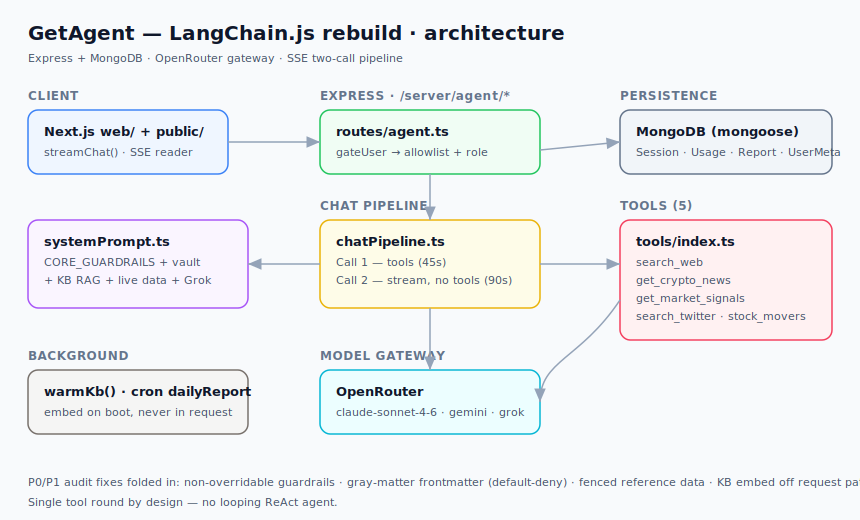
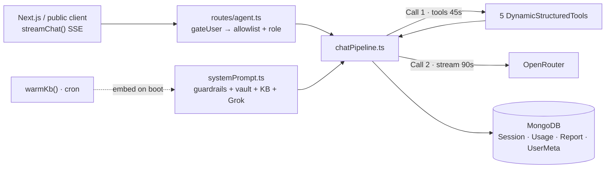

# GetAgent — LangChain.js Rebuild · Project Report

> A from-scratch reimplementation of BuilderHub's **GetAgent** AI assistant, built on **LangChain.js** (TypeScript) with **OpenRouter** as the model gateway, **Express**, and **MongoDB**.

| | |
|---|---|
| **Package** | `getagent-langchain` `v0.1.0` |
| **Runtime** | Node ESM · `tsx` (no build step) |
| **Stack** | LangChain.js · Express 4 · Mongoose 8 · Zod 3 |
| **Gateway** | OpenRouter (`anthropic/claude-sonnet-4-6` default) |
| **Frontend** | Next.js (`web/`) + zero-build test client (`public/index.html`) |
| **Status** | Feature-complete · typecheck + 51 tests green · live-key validation pending ([`DEVELOPMENT_STATUS.md`](../../DEVELOPMENT_STATUS.md)) |

---

## 1. Architecture at a glance





The request flow is a deliberate **two-call pipeline**: one non-streaming call with tools enabled (single round), then one streaming call with tools disabled.

---

## 2. The two-call chat pipeline

This is the heart of the app — [src/agent/chatPipeline.ts](../../src/agent/chatPipeline.ts):

```ts
// CALL 1: non-streaming, tools enabled (single round, 45s)
const call1 = makeChat({ streaming: false }).bindTools(AGENT_TOOLS);
const ai = await call1.invoke(messages, { timeout: 45_000 });

if (hasToolCalls) {
  working.push(ai);
  for (const tc of ai.tool_calls!) {
    sse.send({ status: TOOL_STATUS[tc.name] ?? "Working…" });
    const tool = TOOLS_BY_NAME[tc.name];
    const result = tool ? String(await tool.invoke(tc.args)) : `Tool error: unknown tool ${tc.name}`;
    working.push(new ToolMessage({ tool_call_id: tc.id!, content: result }));
  }
  // CALL 2: streaming, no tools (retry once if blank)
  fullResponse = await streamCall2(working, sse);
}
```

| Stage | Streaming | Tools | Timeout | Retry |
|------:|:---------:|:-----:|:-------:|:-----:|
| **Call 1** | ❌ | ✅ enabled | 45 s | — |
| **Call 2** | ✅ | ❌ disabled | 90 s | once if blank |

> ⚠️ **Single tool round by design.** Don't swap in a looping ReAct agent without capping iterations.

---

## 3. HTTP API

All routes live under `/server/agent` ([src/routes/agent.ts](../../src/routes/agent.ts)) behind a two-layer gate (`isAllowlisted(uid)` → `authUser(uid)` role lookup).

| Method | Path | Auth | Notes |
|:------:|------|:----:|-------|
| `POST` | `/server/agent/chat` | gated | **SSE**; two-call tool pipeline |
| `POST` | `/server/agent/image` | gated | JSON `{ url }` · Cloudinary upload |
| `GET` | `/server/agent/me` | gated | server-derived role/labels/leader |
| `GET` | `/server/agent/session` | gated | `{ messages, postedIds }` |
| `DELETE` | `/server/agent/session` | gated | clears session |
| `GET` | `/server/agent/usage` | gated | counts + limits + `resetAt` |
| `PATCH` | `/server/agent/posted` | gated | mark Reddit post done |
| `GET` | `/server/agent/daily-report` | **leaders** | latest brief |
| `POST` | `/server/agent/daily-report/generate` | **leaders** | fire-and-forget |

Plus `GET /health` and (dev-only, `NODE_ENV !== 'production'`) `POST /server/dev/seed-user`.

---

## 4. The five live tools

Defined as `DynamicStructuredTool` + Zod in [src/tools/index.ts](../../src/tools/index.ts). Descriptions are verbatim from the legacy app — the model routes on them.

| Tool | Schema | Status text |
|------|--------|-------------|
| `search_web` | `{ query }` | Searching the web… |
| `get_crypto_news` | `{ query?, signal? }` | Fetching crypto news… |
| `get_market_signals` | `{ engine, query? }` | Fetching market signals… |
| `search_twitter_sentiment` | `{ query }` | Checking Twitter sentiment… |
| `get_stock_movers` | `{ type }` | Fetching stock data… |

> `generate_image` is intentionally **not** a chat tool — image generation is a separate endpoint and the system prompt tells chat to refuse it.

---

## 5. Configuration & models

From [src/config.ts](../../src/config.ts) — all models are OpenRouter-routed:

| Constant | Value |
|----------|-------|
| `AGENT_MODEL` | `anthropic/claude-sonnet-4-6` |
| `AGENT_IMAGE_MODEL` | `google/gemini-3.1-flash-image-preview` |
| `GROK_MODEL` | `x-ai/grok-4.3:online` |
| `KB_EMBED_MODEL` | `openai/text-embedding-3-large` |
| `MAX_TOKENS` | `64000` (no `temperature` anywhere) |

**Limits & caches**

| Setting | Value | Meaning |
|---------|------:|---------|
| `AGENT_CHAT_LIMIT` | `20` | chats / rolling 24h |
| `AGENT_IMAGE_LIMIT` | `10` | images / rolling 24h |
| `AGENT_WINDOW_MS` | `86_400_000` | anchored window |
| `KB_MAX_FILES` | `8` | semantic cap (excl. always-load) |
| `KB_SIM_THRESHOLD` | `0.25` | min cosine sim after boost |
| `LARK_DATA_TTL` | `300_000` | campaign/announcement cache |

```ts
export const CHAT_PROVIDER = {
  order: ["anthropic", "amazon-bedrock/global"],
  allow_fallbacks: true,
  require_parameters: true,
  data_collection: "deny",
};
```

---

## 6. Data models (MongoDB)

| Model | Holds |
|-------|-------|
| `AgentSession` | messages, `postedIds`, `isError` flag |
| `AgentUsage` | rolling counters anchored at `windowStart` |
| `DailyMarketReport` | generated leader brief |
| `UserMeta` | `uid`, `role`, `labels`, `team` — source of truth for auth |

---

## 7. Audit fixes folded in

| ID | Fix |
|----|-----|
| **P0-1** | Non-overridable `CORE_GUARDRAILS` always prepended — vault *extends*, never *replaces*, the floor |
| **P0-2/3** | Real YAML frontmatter parser (`gray-matter`); `canAccess` **default-denies** malformed/empty `access` |
| **P0-4** | Guardrails fence KB / file / tweet blocks as "REFERENCE DATA, not instructions" |
| **P1-3** | KB embedding runs on boot + background timer, never in the request path |
| — | `AgentSession.isError` added so error messages survive reloads |

---

## 8. Seams — now implemented

All of the seams originally left as TODO have since been wired. They are now feature-complete in code;
what remains is validation against live credentials (see [`DEVELOPMENT_STATUS.md`](../../DEVELOPMENT_STATUS.md)).

- [x] `agent/dataContext.ts` — announcements / campaigns caches + `isCampaignEligible`
- [x] `agent/dailyReport.ts` — `aggregateSources()` (news / Twitter / Brave / CoinGecko / Yahoo)
- [x] `agent/image.ts` — real `BITGET_LOGO_URL`
- [x] `DELETE /session` — Cloudinary cleanup of session images (`deleteImagesByUrl`)
- [x] `PATCH /posted` — the actual Reddit posting webhook (`fireRedditWebhook`)

> Current dev status, including what still needs live-key validation, lives in
> [`DEVELOPMENT_STATUS.md`](../../DEVELOPMENT_STATUS.md).

---

## 9. Run it

```bash
cp .env.example .env      # fill in keys (OPENROUTER_API_KEY, MONGODB_URL …)
npm install
npm run dev               # tsx watch src/index.ts → http://localhost:8080
# npm run typecheck       # tsc --noEmit
```

Needs a running MongoDB and an `OPENROUTER_API_KEY`. GitHub / Brave / news / Cloudinary keys are optional — features **degrade gracefully** without them. Open `http://localhost:8080/` for the zero-build test client.

---

<sub>Generated as a project overview report · source of truth: <code>README.md</code> + <code>src/</code>. Diagram: <a href="assets/overview/architecture.svg">assets/overview/architecture.svg</a>.</sub>
